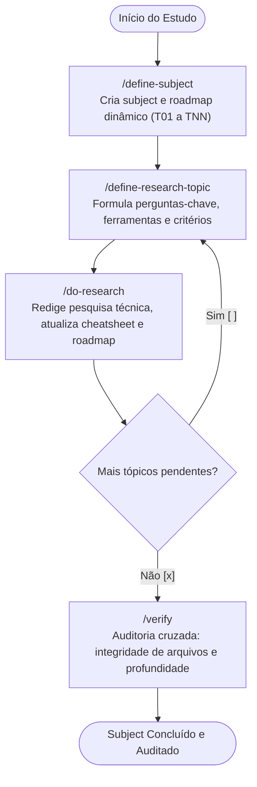
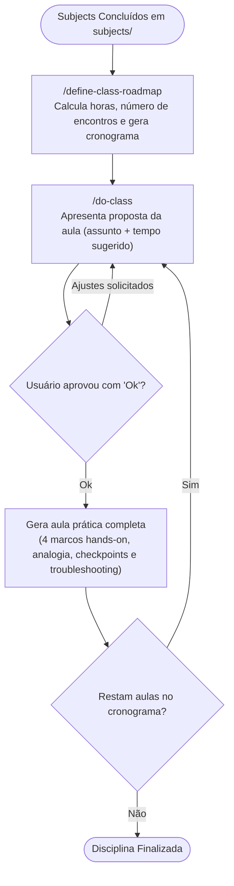

# GERCOM: Aprendizado Federado (Federated Learning)

Base de estudos, pesquisa científica e elaboração de disciplinas práticas do **GERCOM** sobre **Aprendizado Federado (Federated Learning)**.

O repositório é gerenciado através de um ecossistema de **skills orientadas a agentes**, divididas em dois motores complementares:
1. **Motor de Pesquisa Investigativa (`subjects/`)**: Estrutura e aprofunda o conhecimento teórico, matemático e experimental em módulos temáticos.
2. **Motor Pedagógico de Disciplinas (`classes/`)**: Converte a base de pesquisa em cursos práticos e aulas estruturadas com metodologia de alto impacto.

---

## 🔄 Fluxo de Trabalho das Skills

### 1. Ciclo de Pesquisa & Base de Conhecimento (`subjects/`)

Este fluxo conduz o estudo individual de cada tema de Aprendizado Federado, desde a concepção até a validação rigorosa.



#### Passo a Passo Operacional:
1. **`/define-subject [Nome ou contents/]`**:
   - Cria a pasta do assunto em `subjects/<slug>/` com subpastas `plans/`, `research/`, `cheatsheets/`.
   - Gera dinamicamente o `roadmap.md` com a quantidade de tópicos (`T01`, `T02`, ..., `TNN`) proporcional à densidade do tema.
   - Inicializa `cheatsheets/quick-reference.md` e define o assunto ativo no `.agent/context.json`.

2. **`/define-research-topic [ID ou notas]`**:
   - Localiza automaticamente o próximo tópico pendente (`[ ]`) ou o ID informado.
   - Permite que você informe notas prévias para calibrar o plano e pular o básico.
   - Gera o plano investigativo detalhado em `plans/<id>-<slug>-plan.md`.

3. **`/do-research [ID ou plano]`**:
   - Responde com profundidade técnica e matemática a todas as perguntas do plano.
   - Documenta a implementação com código, hiperparâmetros explicados, métricas e análise de desafios (ex.: heterogeneidade não-IID).
   - Extrai snippets essenciais para o cheatsheet rápido e marca o tópico como `[x]` no roadmap.

4. **`/verify [slug]`**:
   - Realiza varredura *Read-Only* de conformidade entre roadmap, arquivos físicos em disco e cheatsheet.
   - Emite relatório com tabela de conformidade, métricas e recomendações de ajustes.

---

### 2. Ciclo Pedagógico & Elaboração de Aulas (`classes/`)

Este fluxo transforma os assuntos pesquisados em cursos formatados com carga horária definida e aulas práticas completas.



#### Passo a Passo Operacional:
1. **`/define-class-roadmap`**:
   - Varre todos os subjects disponíveis em `subjects/` e apresenta o catálogo ao usuário.
   - Coleta requisitos: subjects selecionados, carga horária total (ex.: 40h) e duração por aula (ex.: 120 min).
   - Calcula a quantidade de encontros e pondera a distribuição temporal pela complexidade dos temas.
   - Gera o cronograma mestre da matéria em `classes/<course-slug>/class-roadmap.md`.

2. **`/do-class [Número da aula]`**:
   - Seleciona a próxima aula pendente e apresenta uma **proposta prévia de plano de aula**.
   - **Gate Obrigatório**: Aguarda o `"Ok"` do usuário (ou pedidos de ajuste no tempo/foco) antes de redigir.
   - Redige a aula completa em `classes/<course-slug>/lessons/XX-<slug>.md` com:
     - Promessa clara de competências no início;
     - Analogia do mundo real para intuição mental;
     - Tabela *"O que É vs. O que NÃO É"*;
     - 4 Marcos de avanço prático com código e parâmetros comentados;
     - Checkpoint *"Suba de Volta no Ônibus"*;
     - Perguntas socráticas com respostas ocultas em `<details>`;
     - Troubleshooting de falhas comuns e Desafio Prático autônomo.
   - Atualiza o status no `class-roadmap.md` e recalcula as horas concluídas.

---

## 📁 Estrutura de Diretórios do Projeto

```text
gercom_basic_of_federated_learning/
├── .agent/                           # Inteligência e estado do agente
│   ├── context.json                  # Subject ativo em pesquisa
│   ├── class-context.json            # Disciplina ativa em elaboração
│   └── skills/                       # Skills operacionais executáveis
│       ├── define-subject/
│       ├── define-research-topic/
│       ├── do-research/
│       ├── verify/
│       ├── define-class-roadmap/
│       └── do-class/
├── templates/                        # Modelos canônicos reutilizáveis
│   ├── roadmap-template.md           # Modelo de roadmap do subject (dinâmico)
│   ├── plan-template.md              # Modelo de plano investigativo
│   ├── research-template.md          # Modelo de documentação de pesquisa
│   ├── class-roadmap-template.md     # Modelo de cronograma da matéria
│   └── class-lesson-template.md      # Modelo de aula prática de alto impacto
├── subjects/                         # Base de pesquisa técnica organizada por módulo
│   └── [slug-do-subject]/
│       ├── roadmap.md
│       ├── plans/
│       ├── research/
│       └── cheatsheets/
├── classes/                          # Cursos e disciplinas formatadas
│   └── [slug-da-disciplina]/
│       ├── class-roadmap.md
│       └── lessons/
└── README.md                         # Catálogo geral e guia de uso
```

---

## 📚 Catálogo de Assuntos de Pesquisa

| Assunto | Domínio | Linha de Pesquisa | Status |
| :--- | :--- | :--- | :---: |
| *(Nenhum assunto iniciado ainda. Use `/define-subject` para começar)* | - | - | - |

---

## 🎓 Disciplinas & Cursos Estruturados

| Disciplina | Carga Horária | Aulas Planejadas | Status |
| :--- | :---: | :---: | :---: |
| *(Nenhuma disciplina cadastrada ainda. Use `/define-class-roadmap`)* | - | - | - |
