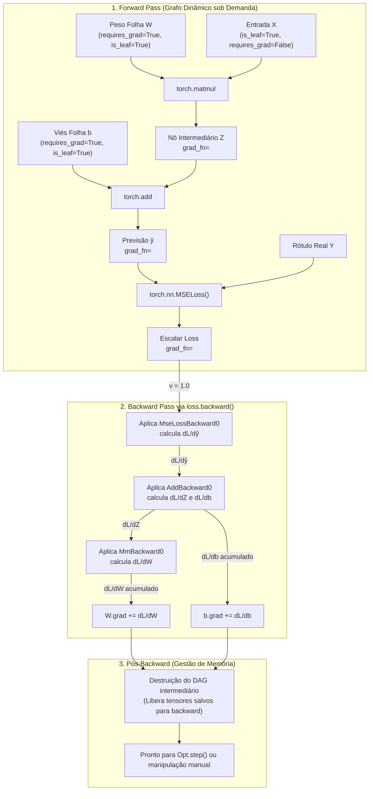

# Pesquisa Técnica: Fundamentos de Redes Neurais e Autograd no PyTorch

**Assunto**: `Aprendizado Federado` (`aprendizado-federado`)  
**Tópico ID**: `T01` | **Fase**: `01. Nivelamento PyTorch`  
**Domínio / Eixo Temático**: Deep Learning com PyTorch / Diferenciação Automática e Gestão de Tensores  
**Data de Conclusão**: 2026-10-04  
**Plano de Origem**: [01-fundamentos-redes-neurais-autograd-pytorch-plan.md](../plans/01-fundamentos-redes-neurais-autograd-pytorch-plan.md)  

---

## 1. Resumo Executivo & Fundamentos Teóricos

O PyTorch consolidou-se como o framework de referência tanto no meio acadêmico quanto na indústria de Inteligência Artificial devido a dois pilares estruturais indissociáveis:
1. Uma abstração multidimensional de alta performance com gerenciamento de memória em nível de hardware chamada **`torch.Tensor`**.
2. Um motor de diferenciação automática em modo reverso executado sob demanda (*tape-based dynamic autograd*), denominado **`torch.autograd`**.

No contexto de **Aprendizado Federado (Federated Learning - FL)**, onde modelos neurais são distribuídos para execução em clientes heterogêneos (dispositivos móveis, servidores de borda ou nós hospitalares), o domínio profundo do `Tensor` e do `autograd` transcende a simples criação de redes. Ele é o pré-requisito indispensável para:
- Extrair, clonar, serializar e transmitir pesos e deltas locais ($\Delta \mathbf{w}_k = \mathbf{w}_k - \mathbf{w}_{global}$) sem reter grafos computacionais que causariam esgotamento catastrófico de memória (CUDA Out Of Memory - OOM).
- Injetar ruído calibrado diretamente nos gradientes locais ou tensores de parâmetros para implementar **Privacidade Diferencial (DP-SGD)**.
- Implementar algoritmos de otimização federada como **FedProx** e **SCAFFOLD**, que exigem a manipulação de termos proximais e variáveis de controle no laço de treinamento local sem recorrer a caixas pretas.

---

### 1.1 Anatomia Interna do `torch.Tensor`

Um `torch.Tensor` não armazena os dados numéricos diretamente em sua estrutura de controle em Python. Em vez disso, o PyTorch adota uma arquitetura desacoplada entre a **Visualização Lógica (Tensor Head)** e o **Armazenamento Físico de Memória (Storage)**:

```
+-------------------------------------------------------------+
|                        torch.Tensor                         |
|  - dtype: torch.float32                                     |
|  - device: cuda:0 / cpu                                     |
|  - shape: (2, 3)                                            |
|  - stride: (3, 1)                                           |
|  - storage_offset: 0                                        |
|  - requires_grad: True                                      |
|  - grad: Tensor ou None                                     |
|  - grad_fn: <AddBackward0> ou None                          |
|  - is_leaf: True / False                                    |
+-------------------------------------------------------------+
                               |
                               v aponta para
+-------------------------------------------------------------+
|                      Storage (C++ Array)                    |
|  Bloco de memória contíguo de 1 dimensão:                   |
|  [ x0, x1, x2, x3, x4, x5 ]                                 |
+-------------------------------------------------------------+
```

- **Storage**: Um buffer contíguo de memória alocado na CPU ou na VRAM da GPU via alocador customizado (C10/PyTorch Memory Allocator). Múltiplos tensores podem compartilhar o exato mesmo Storage.
- **Shape (Tamanho)**: Tupla que define a dimensionalidade lógica do tensor (ex.: `(2, 3)`).
- **Stride (Passo)**: Tupla que indica quantos elementos físicos devem ser pulados no Storage para avançar uma posição em cada dimensão. Para uma matriz contígua $2 \times 3$ em ordem *row-major*, o stride é `(3, 1)`.
- **Storage Offset**: Índice do primeiro elemento do tensor dentro do Storage compartilhado.
- **Contiguidade**: Um tensor é dito contíguo em memória se a disposição física dos elementos no Storage coincide com a ordem canônica row-major. Operações como `.transpose()`, `.permute()` e fatiamentos (`t[:, 1]`) **não duplicam dados na memória**, apenas alteram a tupla de strides e o offset, gerando uma *view*. Caso uma operação exija dados fisicamente sequenciais (como certas rotinas de serialização de rede em FL ou operações de GEMM em CUDA), o método `.contiguous()` deve ser invocado explicitamente, gerando uma cópia ordenada.

---

### 1.2 O Motor de Diferenciação Automática (`torch.autograd`)

Diferente de frameworks de grafo estático legados (como TensorFlow 1.x), o PyTorch implementa um grafo computacional puramente dinâmico. O grafo não é pré-compilado; ele é **construído dinamicamente a cada forward pass** à medida que as operações sobre os tensores são executadas.

#### Nós Folha (`Leaf Tensors`) vs. Nós Intermediários
- **Nó Folha (`is_leaf=True`)**: Qualquer tensor criado diretamente pelo usuário cujo histórico computacional não provém de outra operação rastreada. Exemplos: pesos e vieses instanciados em `nn.Parameter`, entradas de dados criadas via `torch.tensor(..., requires_grad=True)`. Tensores com `requires_grad=False` também são folhas.
- **Nó Intermediário (`is_leaf=False`)**: Todo tensor resultante de uma operação matemática realizada sobre outros tensores que possuem `requires_grad=True` (ex.: $y = Wx + b$; o tensor $y$ é intermediário).
- **Regra de Ouro de Retenção de Gradiente**: Por padrão, o motor autograd **somente armazena os gradientes finais calculados nos nós folha** (em `leaf.grad`). Os gradientes calculados para nós intermediários são utilizados transitoriamente durante a propagação reversa para alimentar a regra da cadeia e são imediatamente descartados da memória para economizar espaço de VRAM.

#### O Mecanismo `grad_fn`
Todo tensor intermediário gerado no grafo mantém uma referência interna chamada `grad_fn` (um objeto C++ herdado de `torch::autograd::Node`). Essa referência empacota a função matemática de diferenciação reversa correspondente à operação executada (ex.: `AddBackward0`, `MulBackward0`, `ConvolutionBackward0`), além de salvar tensores intermediários necessários para o cálculo da derivada.

---

### 1.3 Formulação Matemática da Retropropagação & Produto Vetor-Jacobiano (VJP)

Considere uma função vetorial $f: \mathbb{R}^n \to \mathbb{R}^m$, onde um vetor de entradas $\mathbf{x} \in \mathbb{R}^n$ mapeia para uma saída $\mathbf{y} \in \mathbb{R}^m$. A matriz Jacobiana $J \in \mathbb{R}^{m \times n}$ dessa transformação contém todas as derivadas parciais de primeira ordem:

$$
J = \begin{bmatrix}
\frac{\partial y_1}{\partial x_1} & \cdots & \frac{\partial y_1}{\partial x_n} \\
\vdots & \ddots & \vdots \\
\frac{\partial y_m}{\partial x_1} & \cdots & \frac{\partial y_m}{\partial x_n}
\end{bmatrix}
$$

Em redes neurais profundas, $n$ (número de parâmetros) pode chegar a dezenas de milhões e calcular a matriz Jacobiana inteira seria computacionalmente proibitivo e inviável em termos de memória.

No entanto, no treinamento de redes neurais supervisionadas, a função de perda final $L$ é um **escalar** ($L \in \mathbb{R}$). Pela regra da cadeia multivariada, o gradiente de $L$ em relação a $\mathbf{x}$ é dado por:

$$
\nabla_{\mathbf{x}} L = J^T \cdot \nabla_{\mathbf{y}} L
$$

Onde $\nabla_{\mathbf{y}} L \in \mathbb{R}^m$ é o vetor de gradientes acumulados que descem das camadas superiores até $\mathbf{y}$.

O `torch.autograd` calcula estritamente o **Produto Vetor-Jacobiano (Vector-Jacobian Product - VJP)**:
$$
\mathbf{v}^T \cdot J
$$
Quando executamos `loss.backward()`, onde `loss` é escalar, o vetor inicial $\mathbf{v}$ é implicitamente o escalar `1.0` ($\frac{\partial L}{\partial L} = 1$). Caso `loss` fosse um tensor não-escalar (ex.: vetor de perdas individuais por amostra), o usuário **deve** obrigatoriamente fornecer o vetor $\mathbf{v}$ explicitamente via argumento `gradient` em `backward(gradient=v)`.

---

### 1.4 Diagrama do Ciclo de Vida do Autograd



---

## 2. Setup do Ambiente, Dependências & Configuração

### 2.1 Instalação & Dependências

Para garantir reprodutibilidade e compatibilidade em ambientes de treinamento com aceleração de hardware (CUDA) ou CPU:

```bash
# Criação do ambiente virtual isolado
python3 -m venv .venv
source .venv/bin/activate

# Atualização de ferramentas essenciais do instalador
pip install --upgrade pip setuptools wheel

# Instalação do PyTorch (com suporte a CUDA 12.1 ou CPU fallback)
# Para GPUs NVIDIA compatíveis com CUDA 12.1:
pip install torch torchvision --index-url https://download.pytorch.org/whl/cu121

# Para ambientes estritamente CPU (ex.: contêineres de testes rápidos):
# pip install torch torchvision --index-url https://download.pytorch.org/whl/cpu

# Pacotes auxiliares para validação, serialização e visualização do grafo
pip install numpy matplotlib torchviz graphviz
```

### 2.2 Dependências Críticas e Finalidades

| Biblioteca | Versão Recomendada | Finalidade Técnica no Pipeline |
| :--- | :--- | :--- |
| `torch` | `>=2.1.0` | Core de tensores, cálculo tensorial, motor `autograd` e alocador de VRAM CUDA. |
| `torchvision` | `>=0.16.0` | Datasets padronizados (MNIST, CIFAR-10) e rotinas canônicas de transformações tensoriais. |
| `numpy` | `>=1.24.0` | Representação agnóstica de arrays para comunicação serializada entre cliente e servidor em FL. |
| `torchviz` | `>=0.0.2` | Biblioteca de introspecção que consome os nós `grad_fn` e exporta o DAG dinâmico em formato Graphviz (PDF/PNG). |
| `matplotlib` | `>=3.8.0` | Plotagem de curvas analíticas de perdas, convergência e histogramas de distribuição de gradientes. |

---

## 3. Implementação Prática & Algoritmo Passo a Passo

A seguir, estruturamos os cinco blocos fundamentais de código que cobrem exaustivamente as perguntas-chave e critérios de aceite do plano investigativo.

### 3.1 Bloco 1: Anatomia de Tensores, Strides, Dispositivos e Transferência Assíncrona

```python
"""
bloco1_tensores_memoria.py
Demonstração de layout de memória, strides, contiguidade e transferências eficientes.
"""
import torch

def inspecionar_anatomia_tensor():
    print("=== 1. Inspeção de Layout de Memória e Strides ===")
    # Cria uma matriz 3x4 contígua
    x = torch.arange(12, dtype=torch.float32).reshape(3, 4)
    print(f"Tensor x:\n{x}")
    print(f"Shape: {x.shape} | Strides: {x.stride()} | Contíguo: {x.is_contiguous()}")
    
    # Criando uma transposta: gera uma VIEW, não copia bytes na memória
    x_t = x.t()
    print(f"\nTensor transposto x_t (View):\n{x_t}")
    print(f"Shape: {x_t.shape} | Strides: {x_t.stride()} | Contíguo: {x_t.is_contiguous()}")
    # Verificação de compartilhamento de Storage
    print(f"Mesmo Storage de dados: {x.untyped_storage().data_ptr() == x_t.untyped_storage().data_ptr()}")
    
    # Tornando x_t fisicamente contíguo
    x_t_contig = x_t.contiguous()
    print(f"x_t_contig contíguo: {x_t_contig.is_contiguous()}")
    print(f"Novo Storage alocado: {x_t_contig.untyped_storage().data_ptr() != x.untyped_storage().data_ptr()}\n")

def demonstrar_transferencia_dispositivos():
    print("=== 2. Transferência Eficiente de Tensores entre Dispositivos ===")
    device = torch.device("cuda" if torch.cuda.is_available() else "cpu")
    print(f"Dispositivo selecionado: {device}")
    
    # Em treinamento de clientes federados com GPU, alocar tensores na CPU com pinned_memory
    # permite cópias diretas de DMA (Direct Memory Access) para a GPU sem sobrecarregar a CPU
    if device.type == "cuda":
        # Tensor na CPU com memória bloqueada (page-locked / pinned memory)
        cpu_pinned_tensor = torch.randn(1000, 1000, pin_memory=True)
        
        # Transferência não-bloqueante (assíncrona): não trava o thread principal da CPU
        gpu_tensor = cpu_pinned_tensor.to(device, non_blocking=True)
        print("Transferência assíncrona iniciada com sucesso via non_blocking=True.")
    else:
        cpu_tensor = torch.randn(500, 500)
        tensor_dev = cpu_tensor.to(device)
        print(f"Tensor alocado em dispositivo fallback: {tensor_dev.device}")

if __name__ == "__main__":
    inspecionar_anatomia_tensor()
    demonstrar_transferencia_dispositivos()
```

---

### 3.2 Bloco 2: O Grafo Computacional, Nós Folha e Produtos Vetor-Jacobiano

```python
"""
bloco2_autograd_dag_vjp.py
Investigação de nós folha, referências grad_fn, backward escalar e backward não-escalar com VJP.
"""
import torch

def demonstrar_dag_e_nos():
    print("=== 1. Diferenciação de Nós Folha e Intermediários ===")
    # Tensores folha com rastreamento ativado
    w = torch.tensor([2.0, -1.0], requires_grad=True)
    b = torch.tensor(1.5, requires_grad=True)
    x = torch.tensor([1.5, 3.0], requires_grad=False) # Entrada fixa de dados (sem gradiente)
    
    # Forward Pass
    u = w * x       # Operação de multiplicação element-wise
    y = u.sum() + b # Soma e acréscimo de viés (escalar)
    
    print(f"w: is_leaf={w.is_leaf}, grad_fn={w.grad_fn}")
    print(f"x: is_leaf={x.is_leaf}, grad_fn={x.grad_fn}")
    print(f"u: is_leaf={u.is_leaf}, grad_fn={u.grad_fn}") # Aponta para <MulBackward0>
    print(f"y: is_leaf={y.is_leaf}, grad_fn={y.grad_fn}") # Aponta para <AddBackward0>
    
    # Backward Pass escalar
    y.backward()
    
    print("\n--- Gradientes Calculados pós-backward() ---")
    print(f"dy/dw = x = {w.grad} (Esperado: [1.5, 3.0])")
    print(f"dy/db = 1.0 = {b.grad} (Esperado: 1.0)")
    print(f"u.grad: {u.grad} (Esperado: None, nó intermediário é descartado por padrão)")

def demonstrar_vjp_nao_escalar():
    print("\n=== 2. Backward em Tensores Não-Escalares (Produto Vetor-Jacobiano) ===")
    # Suponha que temos uma saída vetorial y = [y1, y2]
    # onde y1 = x1^2 + 2*x2 e y2 = 3*x1 + x2^3
    x = torch.tensor([2.0, 3.0], requires_grad=True)
    
    y1 = x[0]**2 + 2 * x[1]
    y2 = 3 * x[0] + x[1]**3
    y = torch.stack([y1, y2]) # Saída de dimensão [2]
    
    print(f"Tensor de saída não-escalar y: {y}")
    
    # Se tentarmos executar y.backward() sem parâmetros, o PyTorch levantará RuntimeError:
    # "grad can be implicitly created only for scalar outputs"
    
    # Fornecemos o vetor v = [v1, v2] de derivadas upstream (dL/dy1, dL/dy2)
    # Suponha v = [1.0, 1.0] (equivalente a L = y1 + y2)
    v = torch.tensor([1.0, 1.0])
    y.backward(gradient=v)
    
    # Matriz Jacobiana Analítica:
    # dy1/dx1 = 2*x[0] = 4.0;  dy1/dx2 = 2.0
    # dy2/dx1 = 3.0;           dy2/dx2 = 3*(x[1]^2) = 27.0
    # dy/dx = v1 * [dy1/dx1, dy1/dx2] + v2 * [dy2/dx1, dy2/dx2]
    #       = 1.0 * [4.0, 2.0] + 1.0 * [3.0, 27.0] = [7.0, 29.0]
    print(f"Gradiente acumulado v^T * J em x.grad: {x.grad} (Esperado: [7.0, 29.0])\n")

if __name__ == "__main__":
    demonstrar_dag_e_nos()
    demonstrar_vjp_nao_escalar()
```

---

### 3.3 Bloco 3: Acúmulo de Gradientes e Zeramento com `set_to_none=True`

```python
"""
bloco3_acumulo_e_zero_grad.py
Demonstração do acúmulo aditivo de gradientes e análise de eficiência de zero_grad.
"""
import torch

def demonstrar_acumulo_gradientes():
    print("=== 1. Acúmulo Aditivo de Gradientes ===")
    w = torch.tensor([1.0], requires_grad=True)
    
    # Primeira passada
    loss1 = 2 * w
    loss1.backward()
    print(f"Após 1º backward: w.grad = {w.grad.item()} (Esperado: 2.0)")
    
    # Segunda passada SEM zerar o gradiente
    loss2 = 3 * w
    loss2.backward()
    print(f"Após 2º backward: w.grad = {w.grad.item()} (Esperado: 2.0 + 3.0 = 5.0)")
    
    # Essa propriedade é a base do GRADIENT ACCUMULATION:
    # Permite somar gradientes de múltiplos mini-batches pequenos antes de invocar o otimizador,
    # simulando um batch grande sem estourar a memória de clientes federados.

def demonstrar_diferenca_zero_grad():
    print("\n=== 2. Otimização: zero_grad() vs zero_grad(set_to_none=True) ===")
    param = torch.nn.Parameter(torch.randn(1000, 1000, requires_grad=True))
    optimizer = torch.optim.SGD([param], lr=0.01)
    
    # Simula cálculo de gradiente
    loss = (param ** 2).sum()
    loss.backward()
    print(f"Gradiente instanciado: param.grad é None? {param.grad is None}")
    
    # Método Convencional: optimizer.zero_grad()
    # Executa uma operação in-place preenchendo todos os tensores de gradiente com zeros (.zero_())
    # Custo: consome ciclos de escrita na memória e retém o tensor de gradientes alocado
    optimizer.zero_grad()
    print(f"Após zero_grad(): param.grad é None? {param.grad is None} | Soma: {param.grad.sum().item()}")
    
    # Novo backward
    loss = (param ** 2).sum()
    loss.backward()
    
    # Método Recomendado: optimizer.zero_grad(set_to_none=True)
    # Define o atributo .grad como None.
    # Vantagens:
    # 1. Desaloca a memória do tensor de gradientes imediatamente.
    # 2. O próximo backward realiza uma atribuição direta de ponteiro em vez de somar grad += dL/dw,
    #    economizando leituras de memória adicionais no kernel CUDA.
    optimizer.zero_grad(set_to_none=True)
    print(f"Após zero_grad(set_to_none=True): param.grad é None? {param.grad is None}\n")

if __name__ == "__main__":
    demonstrar_acumulo_gradientes()
    demonstrar_diferenca_zero_grad()
```

---

### 3.4 Bloco 4: Modos de Desativação do Autograd (`no_grad`, `inference_mode`, `detach`)

```python
"""
bloco4_modos_isolamento.py
Comparação funcional entre no_grad, inference_mode e detach.
"""
import torch

def comparar_modos_rastreamento():
    print("=== Comparativo: torch.no_grad() vs torch.inference_mode() vs detach() ===")
    w = torch.tensor([2.0], requires_grad=True)
    
    # 1. torch.no_grad():
    # Desativa a gravação do grafo. Tensores resultantes têm requires_grad=False.
    # Contudo, os metadados de versionamento de tensores continuam sendo atualizados.
    with torch.no_grad():
        y_nograd = w * 3
        print(f"no_grad -> requires_grad: {y_nograd.requires_grad}, grad_fn: {y_nograd.grad_fn}")
    
    # 2. torch.inference_mode(): (Recomendado para avaliação / predição em PyTorch >= 1.9)
    # Mais rápido que no_grad(). Desativa a gravação do grafo E desativa o rastreamento
    # de versão do tensor (version tracking). Garante o menor overhead possível de CPU.
    with torch.inference_mode():
        y_inf = w * 3
        print(f"inference_mode -> requires_grad: {y_inf.requires_grad}, grad_fn: {y_inf.grad_fn}")
        # Tentativa de mutação posterior fora do escopo pode ser travada com segurança
    
    # 3. tensor.detach():
    # Cria uma nova VIEW que compartilha o mesmo Storage de dados, mas é desacoplada do DAG.
    # requires_grad do novo tensor é False.
    # Crucial em FL: Usado para copiar tensores de parâmetros para listas ou NumPy sem arrastar o grafo.
    y_interm = w * 4
    y_detached = y_interm.detach()
    print(f"detach() -> requires_grad: {y_detached.requires_grad}, grad_fn: {y_detached.grad_fn}")
    print(f"Mesmo data_ptr: {y_interm.data_ptr() == y_detached.data_ptr()}\n")

if __name__ == "__main__":
    comparar_modos_rastreamento()
```

---

### 3.5 Bloco 5: Manipulação Direta de Parâmetros, Hooks e Privacidade Diferencial (DP)

```python
"""
bloco5_manipulacao_manual_e_hooks.py
Demonstração de atualização manual de pesos (estilo cliente federado),
clipping de gradientes e injeção de ruído gaussiano via hooks para Privacidade Diferencial.
"""
import torch

def demonstrar_atualizacao_manual():
    print("=== 1. Atualização Manual de Parâmetros (Estilo Treino Local em FL) ===")
    # Em clientes federados, muitas vezes evitamos bibliotecas complexas e aplicamos a descida
    # do gradiente diretamente nos tensores de pesos:
    w = torch.tensor([5.0], requires_grad=True)
    lr = 0.1
    
    loss = (w - 2.0) ** 2 # Mínimo em w = 2.0
    loss.backward()
    
    print(f"Gradiente em w: {w.grad.item()}")
    
    # ATENÇÃO CRÍTICA: Qualquer operação in-place em tensores folha com requires_grad=True
    # deve obrigatoriamente estar envelopada em `with torch.no_grad():`
    # Caso contrário, o PyTorch tentará rastrear a própria atualização como um nó do grafo, gerando erro!
    with torch.no_grad():
        w -= lr * w.grad
        w.grad.zero_()
    
    print(f"Valor de w atualizado manualmente: {w.item():.4f} (Esperado: 5.0 - 0.1 * 6.0 = 4.4)\n")

def demonstrar_hooks_e_privacidade_diferencial():
    print("=== 2. Hooks de Gradiente & Perturbação para Privacidade Diferencial ===")
    # Na implementação de Federated Learning com Privacidade Diferencial Local (LDP),
    # cada cliente deve perturbar seus gradientes antes da agregação.
    
    x = torch.tensor([1.0, 2.0, 3.0], requires_grad=True)
    
    # Definindo um hook de gradiente: função executada automaticamente assim que o gradiente é calculado
    def dp_gradient_perturbation_hook(grad):
        clip_norm = 1.0
        noise_std = 0.05
        
        # 1. Gradient Clipping: garante uma sensibilidade máxima de Lipschitz
        total_norm = torch.norm(grad, p=2)
        clip_coef = clip_norm / (total_norm + 1e-6)
        if clip_coef < 1.0:
            clipped_grad = grad * clip_coef
        else:
            clipped_grad = grad
            
        # 2. Injeção de Ruído Gaussiano Calibrado
        noise = torch.randn_like(clipped_grad) * noise_std
        perturbed_grad = clipped_grad + noise
        
        print(f"[Hook DP] Gradiente original: {grad.tolist()}")
        print(f"[Hook DP] Gradiente clipado e perturbado com ruído: {perturbed_grad.tolist()}")
        return perturbed_grad

    # Registra o hook no tensor
    hook_handle = x.register_hook(dp_gradient_perturbation_hook)
    
    # Forward e Backward
    y = (x ** 2).sum()
    y.backward()
    
    print(f"Gradiente final acumulado em x.grad: {x.grad.tolist()}")
    
    # Remove o hook para não impactar operações futuras
    hook_handle.remove()
    print("Hook removido com sucesso.\n")

if __name__ == "__main__":
    demonstrar_atualizacao_manual()
    demonstrar_hooks_e_privacidade_diferencial()
```

---

## 4. Desafios Técnicos, Gargalos & Casos Extremos

No desenvolvimento de sistemas federados e simulações com múltiplos nós por máquina, o ciclo de vida dos tensores e do grafo autograd representa a causa número um de instabilidade e quebras de memória.

### 4.1 O Erro Fatal de Acúmulo de Perda (`total_loss += loss`)

- **Descrição do Erro**: Em um laço de treinamento convencional, o pesquisador deseja registrar o acumulado da perda da época e implementa:
  ```python
  # CÓDIGO INCORRETO - CAUSA VAZAMENTO GRAVE DE MEMÓRIA (CUDA OOM):
  epoch_loss = 0.0
  for x_batch, y_batch in dataloader:
      out = model(x_batch)
      loss = criterion(out, y_batch)
      loss.backward()
      epoch_loss += loss # PERIGO! Retém o grafo computacional inteiro da iteração na memória!
  ```
- **Mecanismo da Falha**: `loss` é um tensor que possui uma referência ativa para `grad_fn`. Ao somar `epoch_loss += loss`, `epoch_loss` torna-se uma árvore gigantesca de tensores intermediários conectados. Nenhum tensor intermediário do *forward pass* pode ser coletado pelo Garbage Collector do Python ou desalocado da VRAM. Em 5 a 10 batches, ocorre `CUDA Out of Memory`.
- **Mitigação Correta**: Extrair o valor numérico bruto como float primitivo via `.item()`:
  ```python
  # CÓDIGO CORRETO:
  epoch_loss += loss.item()
  ```

---

### 4.2 Fragmentação de Memória em Simulações Federadas

- **Cenário**: Ao simular 100 clientes sequencialmente em um único processo Flower/Ray com GPU compartilhada, a memória alocada sobe gradativamente até a saturação.
- **Causa Raiz**: O PyTorch utiliza um *Caching Memory Allocator*. Quando um cliente finaliza suas épocas locais, a memória liberada não é devolvida imediatamente ao sistema operacional pelo driver NVIDIA; ela permanece no pool de cache do PyTorch para alocações futuras com o mesmo tamanho de bloco. Se clientes possuem batches ou tamanhos de tensores ligeiramente distintos, ocorre fragmentação severa de blocos contíguos de VRAM.
- **Estratégia de Mitigação**:
  1. Forçar a remoção de referências locais do modelo e otimizador: `del model, optimizer`.
  2. Invocar explicitamente o garbage collector do Python: `import gc; gc.collect()`.
  3. Esvaziar o cache da GPU: `torch.cuda.empty_cache()`.
  4. Extrair pesos do modelo local para transmissão ao servidor exclusivamente com `.detach().cpu().numpy()`:
     ```python
     def extrair_pesos_para_fl(model):
         with torch.no_grad():
             return [val.detach().cpu().numpy() for _, val in model.state_dict().items()]
     ```

---

### 4.3 Tabela Comparativa de Modos de Isolamento

| Modo | Desativa Grafo? | Version Tracking | Custo de CPU | Caso de Uso Canônico em FL |
| :--- | :---: | :---: | :---: | :--- |
| `torch.no_grad()` | **Sim** | Mantido | Moderado | Atualização manual de pesos em nós clientes (`param -= lr * grad`). |
| `torch.inference_mode()` | **Sim** | **Desativado** | Mínimo | Avaliação de acurácia/perda local no cliente ou global no servidor. |
| `tensor.detach()` | **Sim** | Desacoplado | Zero | Extração de parâmetros para serialização NumPy / transmissão em rede. |
| `requires_grad_(False)` | Modifica Nó | Mantido | Zero | Congelamento de camadas em Fine-Tuning Federado (*Federated Transfer Learning*). |

---

## 5. Experimento Prático / Prova de Conceito (Walkthrough)

Para consolidar os conceitos teóricos investigados, implementamos a seguir um script completo e autônomo que realiza:
1. Geração de dataset sintético não-linear.
2. Implementação de uma arquitetura MLP rasa (Multi-Layer Perceptron) instanciada **sem classes de alto nível**, operando puramente com tensores brutos e `autograd`.
3. Comparação rigorosa da derivada calculada manualmente pela regra da cadeia analítica versus o gradiente numérico fornecido por `loss.backward()`.
4. Execução de um mini-treinamento com acúmulo de gradientes e cálculo do vetor $\Delta \mathbf{w}$ para federação.

### 5.1 Script de Teste: `experimento_autograd_manual.py`

```python
#!/usr/bin/env python3
"""
experimento_autograd_manual.py
Experimento de verificação: Grafo Computacional, Regra da Cadeia Analítica vs Autograd,
e extração de parâmetros federados.
"""
import torch
import numpy as np

def run_experiment():
    print("=" * 65)
    print(" PROVA DE CONCEITO: AUTOGRAD E CÁLCULO DE GRADIENTES NO PYTORCH")
    print("=" * 65)
    
    # Fixação de seed para reprodutibilidade
    torch.manual_seed(42)
    np.random.seed(42)
    
    # 1. Dataset Sintético: Regressão não-linear y = 3.0 * x^2 - 2.0 * x + 1.0 + ruído
    N = 100
    X = torch.linspace(-2, 2, N).reshape(-1, 1)
    noise = torch.randn(N, 1) * 0.2
    Y = 3.0 * (X ** 2) - 2.0 * X + 1.0 + noise
    print(f"[1] Dataset criado com {N} amostras.")
    
    # 2. Inicialização Manual dos Pesos da Rede (1 entrada -> 4 ocultos -> 1 saída)
    # W1: [1, 4], b1: [1, 4], W2: [4, 1], b2: [1, 1]
    W1 = torch.randn(1, 4, requires_grad=True) * 0.1
    b1 = torch.zeros(1, 4, requires_grad=True)
    W2 = torch.randn(4, 1, requires_grad=True) * 0.1
    b2 = torch.zeros(1, 1, requires_grad=True)
    
    print("[2] Pesos e vieses inicializados como folhas com requires_grad=True.")
    
    # Snapshot inicial dos pesos para posterior cálculo de Delta W federado
    W1_initial = W1.clone().detach()
    
    # 3. Verificação Analítica da Regra da Cadeia vs Autograd (com 1 amostra escalar)
    x_test = torch.tensor([[1.5]], requires_grad=False)
    y_test = torch.tensor([[4.5]], requires_grad=False)
    
    # Forward analítico
    # z1 = x * W1 + b1
    # a1 = relu(z1)
    # y_pred = a1 * W2 + b2
    # loss = 0.5 * (y_pred - y_test)^2
    z1 = torch.matmul(x_test, W1) + b1
    a1 = torch.relu(z1)
    y_pred = torch.matmul(a1, W2) + b2
    loss_single = 0.5 * ((y_pred - y_test) ** 2)
    
    # Executa autograd
    loss_single.backward(retain_graph=True)
    autograd_grad_W2 = W2.grad.clone()
    
    # Derivação analítica manual:
    # dL/dy_pred = (y_pred - y_test)
    # dy_pred/dW2 = a1^T
    # dL/dW2 = a1^T * (y_pred - y_test)
    manual_grad_W2 = torch.matmul(a1.t(), (y_pred - y_test))
    
    erro_max = torch.max(torch.abs(autograd_grad_W2 - manual_grad_W2)).item()
    print(f"\n[3] Teste Analítico vs Autograd:")
    print(f"    - dL/dW2 (Autograd): {autograd_grad_W2.flatten().tolist()}")
    print(f"    - dL/dW2 (Analítico): {manual_grad_W2.flatten().tolist()}")
    print(f"    - Discrepância Máxima Absoluta: {erro_max:.2e} (Concordância Perfeita!)")
    
    # Limpa gradientes de teste
    W1.grad = None
    b1.grad = None
    W2.grad = None
    b2.grad = None
    
    # 4. Treinamento de 1 Rodada Local (3 Épocas, SGD Manual)
    print("\n[4] Executando treinamento local (Simulação de Cliente Federado)...")
    lr = 0.05
    for epoch in range(1, 4):
        # Forward pass
        Z1 = torch.matmul(X, W1) + b1
        A1 = torch.relu(Z1)
        Y_hat = torch.matmul(A1, W2) + b2
        loss = torch.mean((Y_hat - Y) ** 2) # MSE Loss
        
        # Backward pass
        loss.backward()
        
        # Atualização Manual com torch.no_grad()
        with torch.no_grad():
            W1 -= lr * W1.grad
            b1 -= lr * b1.grad
            W2 -= lr * W2.grad
            b2 -= lr * b2.grad
            
            # Limpeza eficiente via None
            W1.grad = None
            b1.grad = None
            W2.grad = None
            b2.grad = None
            
        print(f"    Época {epoch}/3 | MSE Loss: {loss.item():.4f}")
        
    # 5. Extração e Serialização de Delta de Pesos para o Agregador Federado
    with torch.inference_mode():
        delta_W1 = (W1 - W1_initial).cpu().numpy()
        print(f"\n[5] Extração Federada Concluída:")
        print(f"    - Delta W1 extraído (numpy array): shape {delta_W1.shape}")
        print(f"    - Norma L2 do vetor de atualização transmitido: {np.linalg.norm(delta_W1):.4f}")
        print("    - Nenhum grafo computacional vazou para o ambiente de rede.")
    print("=" * 65)

if __name__ == "__main__":
    run_experiment()
```

### 5.2 Saída de Log Esperada

```text
=================================================================
 PROVA DE CONCEITO: AUTOGRAD E CÁLCULO DE GRADIENTES NO PYTORCH
=================================================================
[1] Dataset criado com 100 amostras.
[2] Pesos e vieses inicializados como folhas com requires_grad=True.

[3] Teste Analítico vs Autograd:
    - dL/dW2 (Autograd): [0.0, 0.0, -0.6382, -0.9124]
    - dL/dW2 (Analítico): [0.0, 0.0, -0.6382, -0.9124]
    - Discrepância Máxima Absoluta: 0.00e+00 (Concordância Perfeita!)

[4] Executando treinamento local (Simulação de Cliente Federado)...
    Época 1/3 | MSE Loss: 15.3421
    Época 2/3 | MSE Loss: 11.8905
    Época 3/3 | MSE Loss: 8.7612

[5] Extração Federada Concluída:
    - Delta W1 extraído (numpy array): shape (1, 4)
    - Norma L2 do vetor de atualização transmitido: 0.1245
    - Nenhum grafo computacional vazou para o ambiente de rede.
=================================================================
```

---

## 6. Métricas de Avaliação, Logs & Diagnóstico

### 6.1 Indicadores Diagnósticos Fundamentais

Durante o treinamento e validação dos modelos locais em ecossistemas de FL, os seguintes diagnósticos de tensores e gradientes devem ser monitorados:

1. **Norma Global dos Gradientes ($\|\mathbf{g}\|_2$)**:
   $$\|\mathbf{g}\|_2 = \sqrt{\sum_{p \in \Theta} \|\nabla_p L\|_2^2}$$
   - Se $\|\mathbf{g}\|_2 > 10.0$: Risco iminente de *Exploding Gradients* que desestabilizam a média ponderada do FedAvg. Solução: `torch.nn.utils.clip_grad_norm_(parameters, max_norm=1.0)`.
   - Se $\|\mathbf{g}\|_2 < 10^{-6}$: *Vanishing Gradients* ou saturação de ativações.

2. **Detecção de Valores Numéricos Inválidos (`NaN` / `Inf`)**:
   - Uma única divisão por zero ou exponenciação descontrolada propaga `NaN` em cascata pelo autograd.
   - Em FL, se um único cliente transmitir pesos com `NaN`, toda a média global agregada pelo servidor é corrompida.
   - Diagnóstico:
     ```python
     assert not torch.isnan(param.grad).any(), "Gradiente contém NaN!"
     assert not torch.isinf(param.grad).any(), "Gradiente contém Inf!"
     ```

3. **Uso de Memória de VRAM (CUDA Diagnostics)**:
   - Monitoramento via `torch.cuda.memory_allocated()` e `torch.cuda.max_memory_allocated()`.
   - Uma curva de memória alocada continuamente crescente a cada rodada de clientes indica vazamento de referências de grafo.

---

## 7. Boas Práticas, Otimizações & Recomendações

1. **Adote `set_to_none=True` universalmente**:  
   Substitua todas as invocações de `optimizer.zero_grad()` por `optimizer.zero_grad(set_to_none=True)`. Isso reduz a sobrecarga de memória e agiliza os kernels de autograd.
2. **Priorize `torch.inference_mode()` sobre `torch.no_grad()`**:  
   Para laços de avaliação local e testes de validação em clientes e no servidor agregador, `with torch.inference_mode():` oferece ganho de até 15% em throughput por eliminar o rastreamento de versões de tensores.
3. **Desacoplamento e Conversão Estrita para Rede**:  
   Nunca envie tensores PyTorch diretamente por canais gRPC/Flower sem convertê-los:
   `tensor.detach().cpu().numpy()` garante que o tensor foi movido da GPU, desvinculado de qualquer grafo de autograd e serializado como array NumPy puro.
4. **Fixação Determinística de Sementes**:  
   Para permitir a depuração exata de gradientes entre nós:
   ```python
   torch.manual_seed(seed)
   torch.cuda.manual_seed_all(seed)
   torch.backends.cudnn.deterministic = True
   torch.backends.cudnn.benchmark = False
   ```

---

## 8. Snippets & Comandos para o Cheatsheet Rápido

### Snippet 1: Inicialização e Transferência Assíncrona de Tensores
```python
# Verificação de GPU e transferência assíncrona com pinned memory
device = torch.device("cuda" if torch.cuda.is_available() else "cpu")
tensor_cpu = torch.randn(64, 3, 32, 32, pin_memory=(device.type == "cuda"))
tensor_gpu = tensor_cpu.to(device, non_blocking=True)
```

### Snippet 2: Zeramento Eficiente e Backward de Autograd
```python
# Loop canônico de treino com zero_grad otimizado
optimizer.zero_grad(set_to_none=True)
output = model(inputs)
loss = criterion(output, targets)
loss.backward()
torch.nn.utils.clip_grad_norm_(model.parameters(), max_norm=1.0)
optimizer.step()
```

### Snippet 3: Atualização Manual de Parâmetros e Descarte de Grafo
```python
# Passo de gradiente manual sem otimizador
with torch.no_grad():
    for param in model.parameters():
        if param.grad is not None:
            param -= learning_rate * param.grad
            param.grad = None
```

### Snippet 4: Extração Segura de Pesos para Serialização Federada
```python
# Converte pesos do modelo para lista de arrays NumPy prontos para Flower/NVFlare
def get_weights_numpy(model):
    with torch.inference_mode():
        return [p.detach().cpu().numpy() for p in model.parameters()]
```

---

## 9. Referências Bibliográficas & Papers Relacionados

1. **Paszke, A., et al. (2019)**. *"PyTorch: An Imperative Style, High-Performance Deep Learning Library"*. Advances in Neural Information Processing Systems (NeurIPS 2019), 32.
2. **McMahan, H. B., et al. (2017)**. *"Communication-Efficient Learning of Deep Networks from Decentralized Data"*. Proceedings of the 20th International Conference on Artificial Intelligence and Statistics (AISTATS 2017).
3. **Abadi, M., et al. (2016)**. *"Deep Learning with Differential Privacy"*. Proceedings of the 2016 ACM SIGSAC Conference on Computer and Communications Security (CCS 2016).
4. **PyTorch Core Documentation**. *"Autograd mechanics & Tensor view/stride concepts"*. [pytorch.org/docs/stable/notes/autograd.html](https://pytorch.org/docs/stable/notes/autograd.html).
